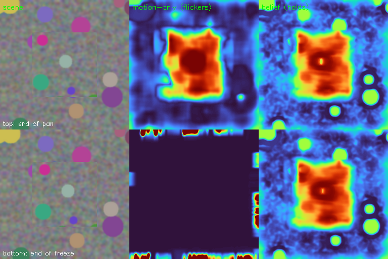

# live_fusion — a depth belief: motion sharpens it, stillness can't erase it



### The two depth organs fail in opposite ways. This is the predictive-coding fusion that keeps the good half of each.

**PerceptionLab / Antti Luode, with Claude (Opus 4.8). Helsinki, June 2026.**

> Do not hype. Do not lie. Just show.

---

## Why this exists

You ran both depth organs and watched each fail in its own way:

- **`the_splat_3d.py` (motion residual)** — real depth from parallax, but it only exists *while you move*. Hold still and it flickers to nothing: no motion → no parallax → flat.
- **`splat3d` / `model.pt` (learned prior)** — stable every frame, but on a real scene it hallucinates. The webcam frame said it plainly: a near-uniform orange map, no real 3D, because the sim prior has nothing true to say about a beer can and a face. You noticed it was *stable* (good — that's the property you wanted) but *flat* (no structure), and lifting a flat map just rotates a flat sheet.

This fuses them the way the flower fused blur and reality: **a prediction, corrected by precision-weighted error.** It keeps a depth **belief** `D` and, each frame:

1. **predict** — warp `D` forward by the estimated global motion (the_anchor's "boil"), so the belief stays registered to the scene as the camera pans.
2. **correct** — measure motion-parallax depth `M` (the_splat_3d residual) and pull `D` toward it, weighted by **confidence** = *(how much the camera moved)* × *(how much texture is here)*. Still camera → confidence ≈ 0 → the belief is **held**, not wiped. Moving camera → confidence rises → the belief **sharpens** toward real parallax.
3. **anchor** *(optional)* — when confidence is chronically low, drift `D` gently toward the learned prior `P` from `model.pt`: the "eyes-closed" fallback.

The result is stable through stillness (the property you liked) **and** carries real structure from your own motion (the property the sim prior can't give). Crucially, **it does not depend on the weak prior** — the learned model is a soft attractor, not the load-bearing part. The depth comes from your motion; the prior just colours the gaps.

---

## The meter (verified, on this machine)

`--smoke` builds a synthetic sequence: a camera pans right for 6 frames — a near patch sliding 4.5 px/frame over a background sliding 1.5 px/frame — then **freezes** for 6 identical frames. We measure the near-vs-far depth separation (positive = the near patch is correctly read as nearer) for both the raw motion-only depth and the fused belief, at the end of the pan and at the end of the freeze:

```
end of PAN  :  belief sep = +0.634    motion-only sep = +0.735
end of FREEZE: belief sep = +0.666    motion-only sep = -0.068

motion-only collapses when frozen:  +0.735  ->  -0.068
belief HOLDS through the freeze:     +0.634  ->  +0.666
VERDICT: PASS — the belief persists through stillness
```

Read it straight: while panning, motion-only correctly separates near from far (+0.735), and the belief builds the same structure from it (+0.634). The instant everything freezes, **motion-only collapses to noise (−0.068)** — exactly the flicker you saw on the webcam — while **the belief holds (+0.666)**, even firming up slightly as the warp settles. The panel above shows it: bottom-middle (motion-only, frozen) goes black; bottom-right (belief, frozen) still holds the near patch warm.

---

## Run it

```bash
pip install opencv-python numpy

# the meter first — no camera, reproduces the numbers above
python live_fusion.py --smoke --save_dir out_fusion

# live: MOVE sideways to write depth into the belief, then hold still and watch it PERSIST
python live_fusion.py --cam 0
python live_fusion.py --cam 1                       # OBS virtual cam is often index 1

# optional: wire your trained model.pt as the soft "eyes-closed" anchor
python live_fusion.py --cam 0 --model runs/splat3d/model.pt --prior_pull 0.15
```

Three panels: `retina | motion-only (flickers) | belief (held + sharpened)`. Pan the camera left/right and the belief fills in; stop and it stays. The `cam motion` readout shows the confidence gate opening and closing as you move.

> If you pass `--model`, edit the `Splat3D(56, 128, 192)` line in `run_live` to match your checkpoint's `image_size / latent / num_packets`. The prior is resized to the working resolution and used only as a low-confidence attractor.

---

## The honest ledger

**Verified by running it (synthetic pan-then-freeze):**
- motion-only separates near/far while moving (+0.735) and collapses when frozen (−0.068);
- the belief builds that separation from motion (+0.634) and holds it through the freeze (+0.666) — it does not go blank when you stop.

**What it actually is, stated plainly:** a leaky predictive depth filter. The depth signal is classical motion parallax (the_splat_3d); the belief is a confidence-gated temporal hold (the_video_tensor's leaky prediction, on depth); the global-motion predict step is the_anchor's boil used to keep the belief registered. The learned `splat3d` prior is an optional soft anchor.

**Borrowed, not invented (the established neighbourhood):** temporal depth fusion / monocular dense tracking (DTAM-style), Kalman-flavoured filtering, motion parallax → depth (Longuet-Higgins & Prazdny 1980), predictive coding (Rao & Ballard 1999). The contribution is only the framing and wiring — a depth belief in the predictive-coding line, fusing the four organs you already built.

**Honest limits — read before believing it:**
- **relative, not metric.** `M` is normalized per frame, so the belief is a relative ordering, not millimetres, and its absolute scale drifts.
- **needs your motion.** With no movement ever, there is nothing to write and the belief stays at its flat init (or at the weak prior, if loaded). It earns depth from parallax; it can't conjure it from a frozen first frame.
- **independent motion fools it.** A hand waved across the frame reads as "near" because its flow deviates from the global model — the same illusion the visual system has.
- **the learned-prior anchor is weak on real scenes today.** The webcam frame proved the sim-to-real gap. Train it better (real meshes, harder domain randomization, or real RGBD) and it plugs straight into the anchor slot — but the fusion already gives real live depth from your motion *without* waiting on that.
- verified only on the synthetic meter; the live path reuses the verified motion functions but real-scene behaviour is not a measured claim.

**The bet (untouched):** that this is the shape of how you actually see depth — a held belief, written by self-motion across saccades, that survives the moments you stop moving. The demo locates the mechanism in code that can fail. It does not prove the brain does it this way.

---

## Where it goes next

1. **A real prior makes the freeze smarter.** Right now a long freeze just holds the last motion-written belief. With a trained, real-scene prior in the anchor slot, stillness would relax toward a *sensible* guess instead of a frozen snapshot — closer to how imagery fills in when your eyes settle.
2. **Per-pixel confidence, not just global.** Gate the correction by local flow reliability (forward-backward flow consistency), so occlusion edges and textureless walls stop injecting garbage into the belief.
3. **Feed the belief back as the motion prior.** Use the current depth belief to *predict* next-frame flow (near things will move more), making the residual smaller and the parallax read cleaner — the loop closing on itself, which is the whole predictive-coding idea.

---

## Lineage

The fusion organ of `the_splat`. It stands on [`the_splat_3d`](./the_splat_3d.py) (the motion residual it corrects with), [`the_anchor`](../the_anchor) (the global motion it predicts with), [`the_video_tensor`](../the_video_tensor) (the leaky hold it remembers with), and [`splat3d`](./splat3d.py) (the learned prior it anchors to). The framing — that depth is a belief held through stillness and sharpened by motion — is Antti Luode's; the build, the meter, and this document are with Claude (Opus 4.8). MIT.

*One organ saw depth only while moving and forgot it the instant it stopped. One saw the same flat guess forever. Hold a belief, let motion write to it, and stillness can no longer erase what you already saw. Do not hype. Do not lie. Just show.*
